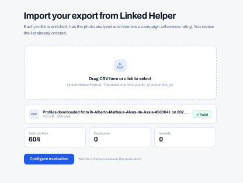
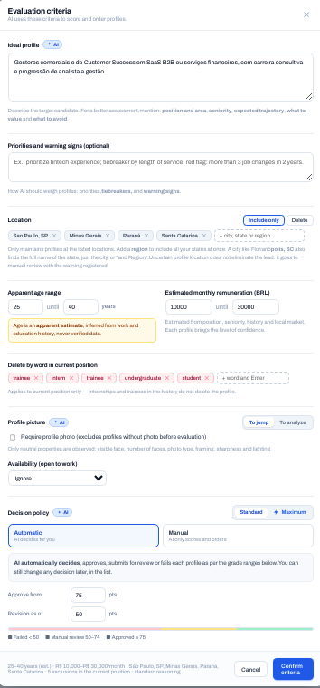
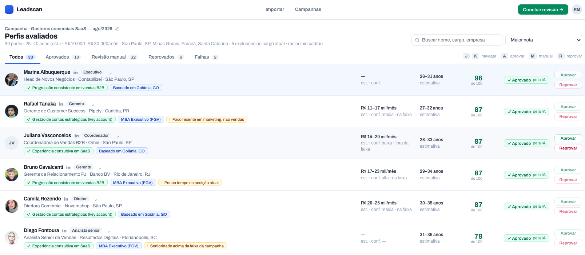
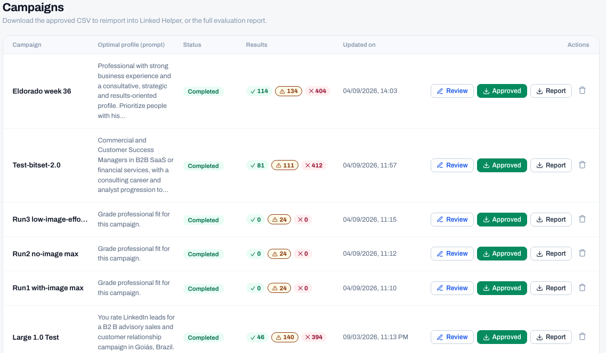

<div align="center">

<pre>
 **       **          **                  ** **                              **
/**      //          /**                 /**/**                             /**
/**       ** ******* /**  **  *****      /**/**        *****   ******       /**
/**      /**//**///**/** **  **///**  ******/**       **///** //////**   ******
/**      /** /**  /**/****  /******* **///**/**      /*******  *******  **///**
/**      /** /**  /**/**/** /**//// /**  /**/**      /**////  **////** /**  /**
/********/** ***  /**/**//**//******//******/********//******//********//******
//////// // ///   // //  //  //////  ////// ////////  //////  ////////  //////
</pre>

**Filter LinkedIn lead lists against custom criteria using an LLM pipeline, with a review UI for campaigns.**

</div>

This project was created with the intent to help a business that ran campaigns through a platform called
LinkedHelper and then manually had to filter them (one by one) through their requirements.

My goal was to create something that could filter a batch of profiles based on criteria set by the user.

## Architecture

- The current pipeline follows this flow:

  ```mermaid
  flowchart LR
      A[Collect profiles<br/>Apify] --> B[Map / parse]
      B --> C[Extract images]
      C --> D[LLM evaluation]
      D --> E[(Storage)]
      E --> F[Web UI review]
  ```

### Break Down


**A good implementation detail to mention is that I designed most of this to work as an intermediary between
LinkedHelper (third-party software) and the user. My application, for now, just exists to simplify an
outside job that LinkedHelper lacks having.**

- 1.1: The process starts with an input of a CSV formatted file (since LinkedHelper exports the campaign as a CSV).

- 1.2: Then we import the CSV through an HTTP request (which will be covered in another documentation) and
extract the profile links from the document.

- 1.3: We then run it through a third-party API, currently called Harvest API, that given the profile links
returns the full profile data (experience, education, location, headline, photo, etc). This runs through
Apify, in batches with bounded concurrency, so a run of hundreds of profiles doesn't get sent as one giant
request.

- 1.4: Each raw profile then gets mapped into the app's own profile model, and correlated back to the
public_id from the original CSV so we never lose track of which LinkedHelper lead a profile belongs to.
One malformed record from the provider doesn't take the rest of the batch down with it, it just gets
logged as a failure and the pipeline keeps going.

- 1.5: If the profile has a photo, we run it through an image analysis step (this part is optional, since
it costs extra tokens and isn't always needed to make a decision).

**Another implementation detail worth mentioning: before anything touches the LLM, a deterministic broad
filter runs first and excludes profiles that obviously fail the criteria (wrong country, missing a required
field, etc). Only the profiles that survive that filter get sent to the model, so we're not spending tokens
on profiles that were never going to pass anyway.**

- 1.6: The profiles that make it past the broad filter get evaluated by an LLM against the criteria the
user defined for that campaign. Model calls go through a generic model layer instead of being hardcoded
to one provider, so it can run against Gemini or OpenRouter without touching the evaluation logic itself.

- 1.7: Everything (profiles, image assessments, evaluation results) gets persisted, and from there the
web UI is where the actual review happens: upload a campaign, watch it run, and go through the profiles
one by one (or bulk-approve/reject) with the model's reasoning and the extracted photo right next to each
decision.

## Screenshots

_All shown with the app's built-in mock data (`?mock` in the URL) — no real campaigns or profiles._

| Upload a campaign | Set the criteria |
| --- | --- |
|  |  |

| Review profiles | Campaign list |
| --- | --- |
|  |  |

## Tech Stack

- **Backend:** TypeScript, Node.js (22+), Fastify for the API server, Pino for logging, and Node's
  built-in `node:sqlite` for storage.
- **Frontend:** React 19 with Vite and TypeScript.
- **External services:** Apify (running the Harvest API LinkedIn scraper) for profile collection, and
  either Gemini or OpenRouter for evaluation and image analysis, switchable through a single env var.
- **Tests:** Node's built-in test runner (`node --test`), no external test framework.

## Setup

1. Clone the repo and install dependencies for both the backend and the web app:

   ```bash
   npm install
   cd web && npm install && cd ..
   ```

2. Copy `.env.example` to `.env` and fill in the required secrets:

   ```bash
   cp .env.example .env
   ```

   At minimum you need `APIFY_API_KEY` and one model provider key (`GEMINI_API_KEY` or
   `OPENROUTER_API_KEY`, matching whatever you set `MODEL_PROVIDER` to). Everything else in
   `.env.example` has a sane default and can be left blank.

3. Run the API server:

   ```bash
   npm run serve
   ```

4. In a separate terminal, run the web app:

   ```bash
   cd web && npm run dev
   ```

   The web app proxies API requests to `localhost:3000`, so the server needs to already be running.

5. Open the local Vite URL, upload a LinkedHelper campaign CSV, set your criteria, and run the pipeline.

### Running the pipeline without the UI

The same pipeline is also reachable straight from the CLI, which is what the `npm run serve` API wraps:

```bash
npm run collect        # import a CSV and collect full profiles
npm run review         # run evaluation against a set of criteria
```

### Tests

```bash
npm test
```

Runs the TypeScript type-check and the full unit test suite.
