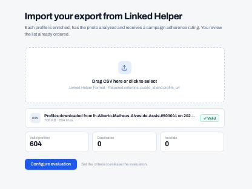
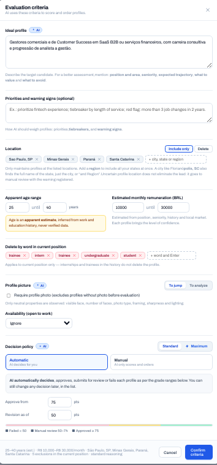
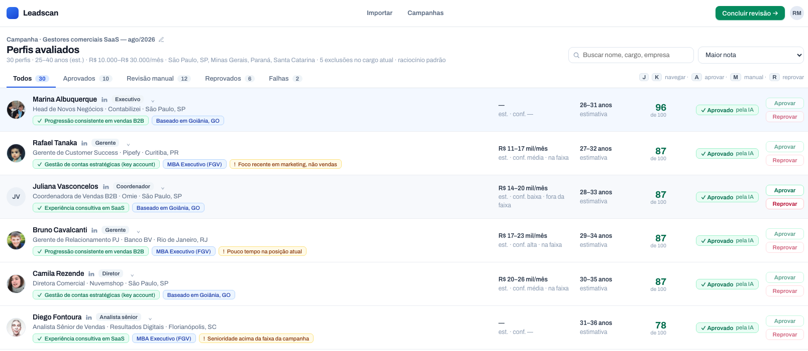
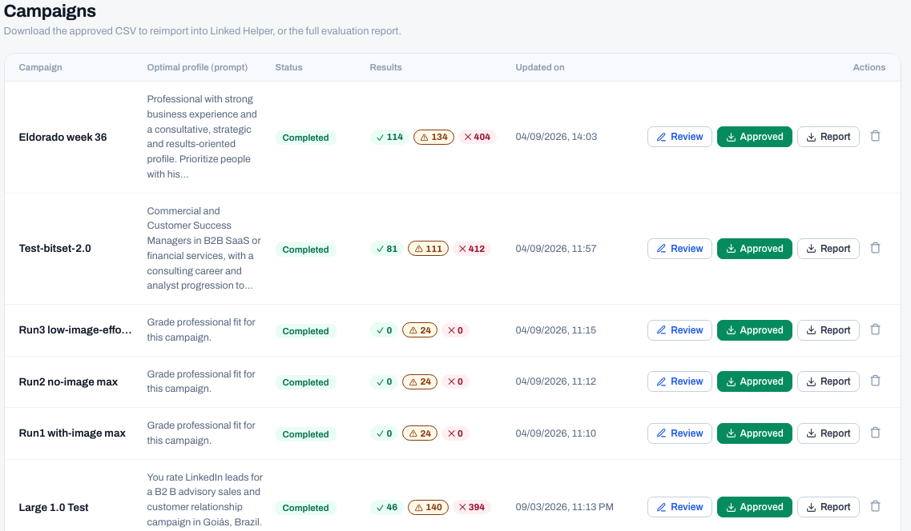

<!-- Local development: keep experimental scripts out of application checks. -->

Development checks: `npm test` checks and tests application code. Local scripts
are checked separately with `npm run typecheck:experiments` and
`npm run test:experiments`; they may require local data and credentials.
The `scripts/` directory remains ignored. Promote reusable tooling into tracked
source before making it a dependency of application commands.

<div align="center">

<pre>
 **       **          **                  ** **                              **
/**      //          /**                 /**/**                             /**
/**       ** ******* /**  **  *****      /**/**        *****   ******       /**
/**      /**//**///**/** **  **///**  ******/**       **///** //////**   ******
/**      /** /**  /**/****  /******* **///**/**      /*******  *******  **///**
/**      /** /**  /**/**/** /**//// /**  /**/**      /**////  **////** /**  /**
/********/** ***  /**/**//**//******//******/********//******//********//******
//////// // ///   // //  //  //////  ////// ////////  //////  ////////  //////
</pre>

**Filter LinkedIn lead lists against custom criteria using an LLM pipeline, with a review UI for campaigns.**

</div>

This project was created with the intent to help a business that ran campaigns through a platform called
LinkedHelper and then manually had to filter them (one by one) through their requirements.

My goal was to create something that could filter a batch of profiles based on criteria set by the user.

## Architecture

- The current pipeline follows this flow:

  ```mermaid
  flowchart LR
      A[Upload CSV<br/>Perfis baixados] --> B[Map career columns]
      B --> C[Broad filter]
      C --> D[Load photos]
      D --> E[LLM evaluation]
      E --> F[(Storage)]
      F --> G[Web UI review]
  ```

### Break Down


**A good implementation detail to mention is that I designed most of this to work as an intermediary between
LinkedHelper (third-party software) and the user. My application, for now, just exists to simplify an
outside job that LinkedHelper lacks having.**

- 1.1: The process starts with a CSV that LinkedHelper exports for the campaign. It has to be the
"Perfis baixados" export, which carries each person's career: numbered columns for every job
(`organization_N`, `organization_title_N`, dates, description) and school (`education_N`, degree, field,
dates), plus the About text, location and photo URL. A lighter export without those columns is refused
at upload.

- 1.2: The CSV is uploaded through an HTTP request and parsed straight away, so the upload screen can
report what the file holds before anything is spent.

- 1.3: Each row is mapped into the app's own profile model (`src/mapper/linked_helper_csv_profile_mapper.ts`),
keyed by the row's `public_id` so every result traces back to its LinkedHelper lead. The export appends
labels such as "· No local" to a job location or puts "· Tempo integral" in an empty description; the
mapper splits those into workplace and employment-type fields. One row that cannot be mapped is logged
and skipped without taking the rest of the campaign down with it.

  Profiles used to be collected from Apify scrapers instead. The last commit with that pipeline is
  recorded in `docs/ROLLBACK_POINTS.md`.

- 1.4: The export has limits the model is told about: it keeps only the first few education entries
(usually the most recent) and a fixed number of jobs, and its photos are small thumbnails.

- 1.5: Photos are downloaded and sent with the evaluation request itself, so the model looks at the
picture rather than at someone else's description of it. There used to be a separate vision call here
whose written summary was passed along as text; that billed the same photo twice and threw away detail,
so it's gone. A campaign can still opt out with `skipImageAnalysis`, and a photo whose URL has expired
(LinkedIn signs them with a short life) simply drops out, with the profile evaluated on text alone.

**Another implementation detail worth mentioning: before anything touches the LLM, a deterministic broad
filter runs first and excludes profiles that obviously fail the criteria (wrong country, missing a required
field, etc). Only the profiles that survive that filter get sent to the model, so we're not spending tokens
on profiles that were never going to pass anyway.**

- 1.6: The profiles that make it past the broad filter get evaluated by an LLM against the criteria the
user defined for that campaign. Model calls go through a generic model layer instead of being hardcoded
to one provider, so the model can be swapped through a single env var without touching the evaluation logic itself.
Profiles go up in small groups rather than one request per person, and a group that fails is retried on
its own: the rest of the run keeps its scores. Anyone still unscored after that is pooled into a single
follow-up round, which is what the UI is reporting when the bar sits near full and says it is reprocessing.

- 1.7: Everything (profiles, image assessments, evaluation results) gets persisted, and from there the
web UI is where the actual review happens: upload a campaign, watch it run, and go through the profiles
one by one (or bulk-approve/reject) with the model's reasoning and the extracted photo right next to each
decision.

## Screenshots

_All shown with the app's built-in mock data (`?mock` in the URL) — no real campaigns or profiles._

| Upload a campaign | Set the criteria |
| --- | --- |
|  |  |

| Review profiles | Campaign list |
| --- | --- |
|  |  |

## Tech Stack

- **Backend:** TypeScript, Node.js (22+), Fastify for the API server, Pino for logging, and Node's
  built-in `node:sqlite` for storage.
- **Frontend:** React 19 with Vite and TypeScript.
- **External services:** OpenRouter for evaluation, with the profile photo sent as part of the same
  request (any model it serves, selected through a single env var). Profile data comes from the
  LinkedHelper CSV itself.
- **Tests:** Node's built-in test runner (`node --test`), no external test framework.

## Handing it to someone non-technical

`COMO-USAR.md` is the guide for an operator who will never open a terminal, and
`Instalar.bat` / `Leadscan.bat` are what they actually double-click on Windows.
The installer checks for Node, installs both dependency trees, builds the app,
and drops a Desktop shortcut; the launcher starts the server and opens the
browser. The OpenRouter key is pasted into a setup screen in the app rather than a
`.env` file, so nothing below is required of them.

## Setup

1. Clone the repo and install dependencies for both the backend and the web app:

   ```bash
   npm install
   cd web && npm install && cd ..
   ```

2. Copy `.env.example` to `.env` and fill in the required secrets:

   ```bash
   cp .env.example .env
   ```

   Everything in `.env.example` has a sane default and can be left blank —
   including `OPENROUTER_API_KEY`, which the app asks for on its setup screen
   if it is absent. Setting it here is the override for a development machine:
   a key in the environment wins over one saved from the browser.

3. Run the whole app as one process:

   ```bash
   npm run app
   ```

   This builds the server and the web bundle, then serves both from
   `localhost:3000`. Open it, paste the OpenRouter key when asked, upload a
   LinkedHelper "Perfis baixados" CSV, set your criteria, and run the pipeline.

   For frontend work you still want Vite's hot reload, which needs the two
   processes:

   ```bash
   npm run serve            # terminal 1
   cd web && npm run dev    # terminal 2
   ```

   The dev server proxies API requests to `localhost:3000`, so the API needs to
   already be running.

### Running the pipeline without the UI

The same pipeline is also reachable straight from the CLI, which is what the `npm run serve` API wraps:

```bash
npm start -- profiles.csv                  # import a CSV only
npm run review -- profiles.csv criteria.json   # import and evaluate
```

### Tests

```bash
npm test
```

Runs the TypeScript type-check and the full unit test suite.
